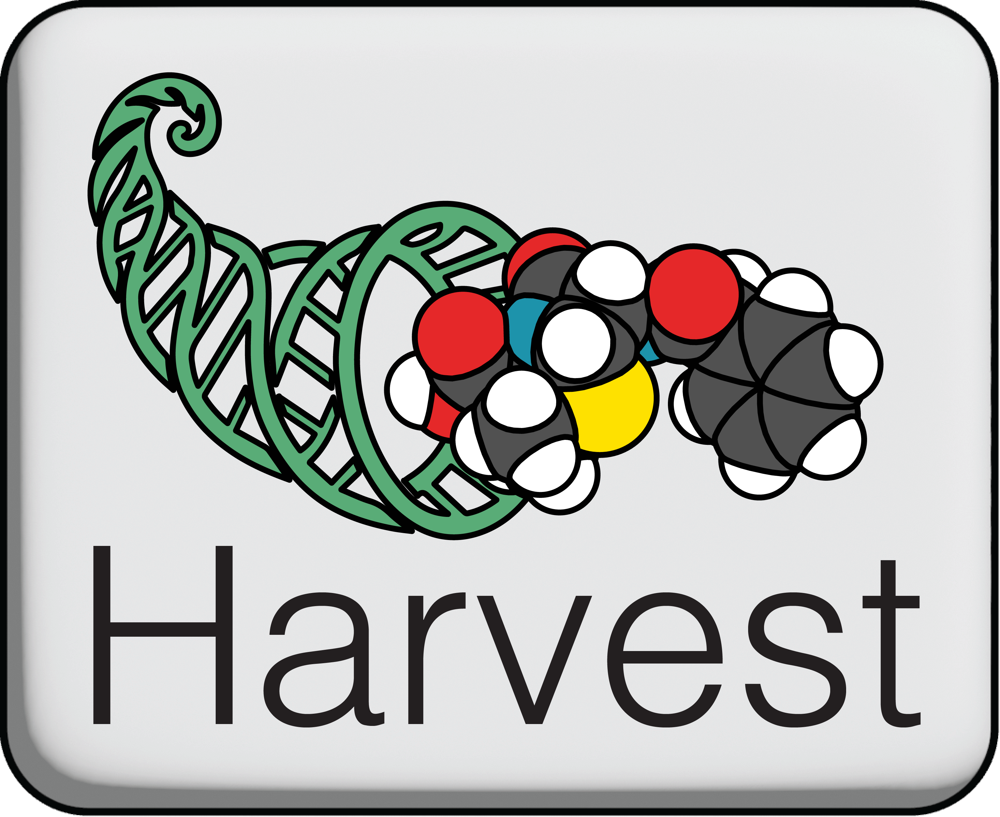

<p align="center">
  
</p>

<p align="center">
    <a href="https://github.com/skinniderlab/CLM/actions/workflows/tests.yml">
      </a>
    <a href="https://coveralls.io/github/skinniderlab/CLM?branch=master">
      </a>
</p>

This repository contains Python source code required to train and evaluate chemical language models for generating natural compound structures.

The CLM code is forked from [https://github.com/skinniderlab/CLM](https://github.com/skinniderlab/CLM).

Complete documentation for the CLM is available at [https://skinniderlab.github.io/CLM/](https://skinniderlab.github.io/CLM/)

## Overview

Harvest contains of an unconditional and a conditional CLM.
The unconditional CLM is a model that generates natural product-like compounds similar to real natural products.

The conditional CLM is able to generate natural product(-like) compounds based on biosynthetic cues extracted from sequence data.

A conditional Harvest model is trained on synthetic natural products, retrobiosynthesized using [RetroMol](https://github.com/moltools/retromol).
At inference time, a conditional Harvest model can ingest [antiSMASH](https://antismash.secondarymetabolites.org/#!/start) generated output file to generate natural product(-like) compounds based on the biosynthetic cues contained in the GenBank file.

## Installation

To install the CLM-Harvest package, clone this repository and install the package using Conda:

```bash
cond create -f environment.yml
conda activate clm-harvest
```

One installed, models can be trained and evaluated using the `harvest` command line interface (CLI).

## Usage

See `harvest --help` for available commands and options.

### Train a CLM

Train a CLM via the Snakemake workflow from any working directory:

```bash
harvest train \
  --configfile /absolute/path/to/config_harvest_cond.yaml \
  --jobs 10 \
  --default-resources slurm_partition=skinniderlab \
  --latency-wait 60 \
  --rerun-incomplete \
  --snakemake-args --slurm
```

Override config values from the command line (e.g., `paths.output_dir` and `paths.dataset`):

```bash
harvest train \
  --configfile /absolute/path/to/config_harvest_cond.yaml \
  --jobs 10 \
  --snakemake-args --config paths.output_dir=/absolute/path/to/output_dir paths.dataset=/absolute/path/to/dataset.smi
```

If for some reason Snakemake does not allow for dotted keys, pass a YAML mapping for `paths` instead:

```bash
harvest train \
  --configfile /absolute/path/to/config_harvest_cond.yaml \
  --jobs 10 \
  --snakemake-args --config 'paths={output_dir: /absolute/path/to/output_dir, dataset: /absolute/path/to/dataset.smi}'
```

### Sample an unconditional CLM

Sample an unconditional model:

```bash
harvest sample-unconditional \
  --model-dir /absolute/path/to/trained_model_dir \
  --out-dir /absolute/path/to/output_dir \
  --device cpu \
  --num-samples 1000
```

See `harvest sample-unconditional --help` for more options when sampling the unconditional CLM.

### Parse compounds with RetroMol

Parse compounds with RetroMol:

```bash
harvest run-retromol \
  --data-path /absolute/path/to/input_file.csv \
  --reaction-rules-path /absolute/path/to/reaction_rules.yaml \
  --matching-rules-path /absolute/path/to/matching_rules.yaml \
  --out-dir /absolute/path/to/output_dir \
```

You can adjust the number of workers with `--num-workers` to improve performance when parsing large datasets with RetroMol. See `harvest run-retromol --help` for more details.
